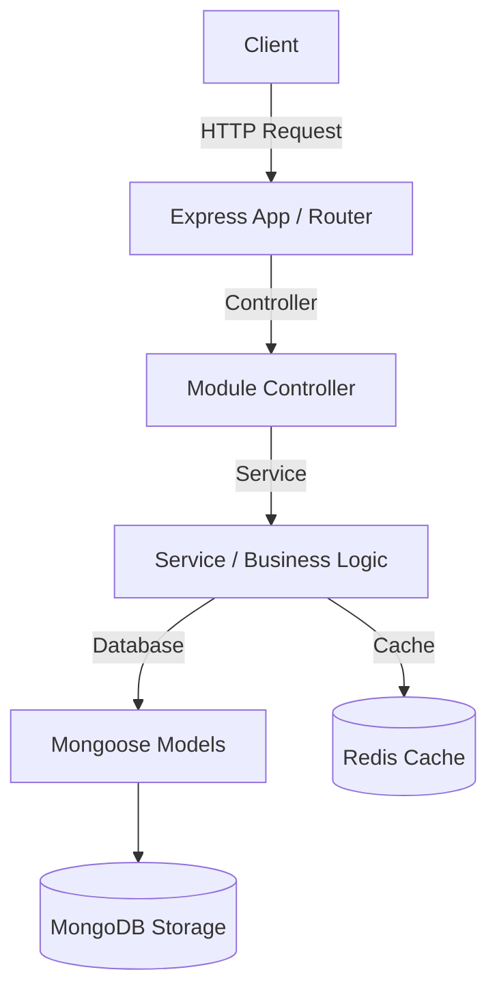

# Architecture & Code Structure

The **Appointment Backend** follows a multi-tier, modular architecture designed for scalability, maintainability, and ease of testing.

## High-Level Flow

## Directory Structure

The `src/` directory is the core of the application:

### `/src`
- **`app.ts`**: The main Express application wrapper. Configures all middlewares (security, logging, parsing) and global routes.
- **`server.ts`**: The entry point. Handles database connections and starts the server instance.

### `/src/common`
Shared resources used across the application to prevent duplication.
- **`middlewares/`**: Contains global middlewares, such as the `errorHandler` for unified exception handling.
- **`errors/`**: Contains custom error classes, such as `AppError`, used to throw known operational errors with a specific HTTP status code.

### `/src/config`
Application configuration files.
- **`env.ts`**: Validates environment variables to ensure the process fails fast if required configurations are absent.
- **`logger.ts`**: Winston logger configuration for standardized application logging.

### `/src/database`
Database connection setups and configurations.
- **`mongo.ts`**: MongoDB connection handling using Mongoose.
- **`redis.ts`**: Redis connection handling.

### `/src/docs`
API documentation.
- **`swagger.yaml`**: OpenAPI 3.0 specification for the project's endpoints.

### `/src/modules`
The application is split into domain-specific modules. Each module contains its own routes, controllers, services, and models.
Example module structure (`/src/modules/example`):
- `example.routes.ts`: Maps HTTP methods and paths to controller functions.
- `example.controller.ts`: Extracts parameters/body from the request and calls the service. Returns formatted responses.
- `example.service.ts`: Core business logic interacting with databases or other external APIs.
- `example.model.ts`: Mongoose schema and model definition.

### `/src/types`
TypeScript type definitions and interfaces for overall project safety.

---

## Technical Stack & Libraries
- **Language**: TypeScript + Node.js
- **Framework**: Express.js
- **Databases**: MongoDB (Mongoose), Redis (ioredis)
- **Security**: Helmet, CORS, Express-Rate-Limit
- **Logging**: Morgan (HTTP request logging) + Winston (Application logging)
- **Error Handling**: Custom `AppError` + centralized Express error handling middleware
